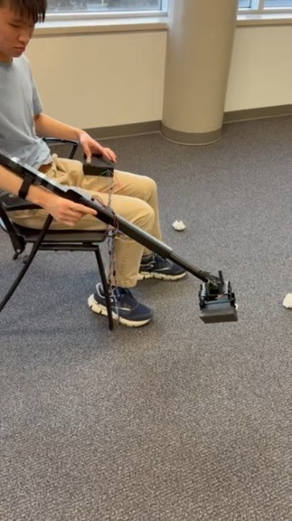
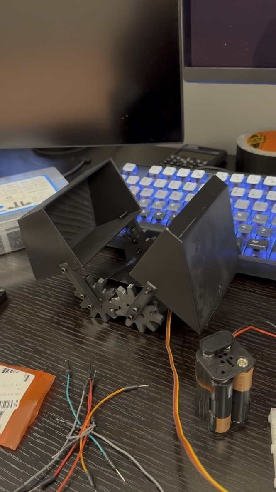
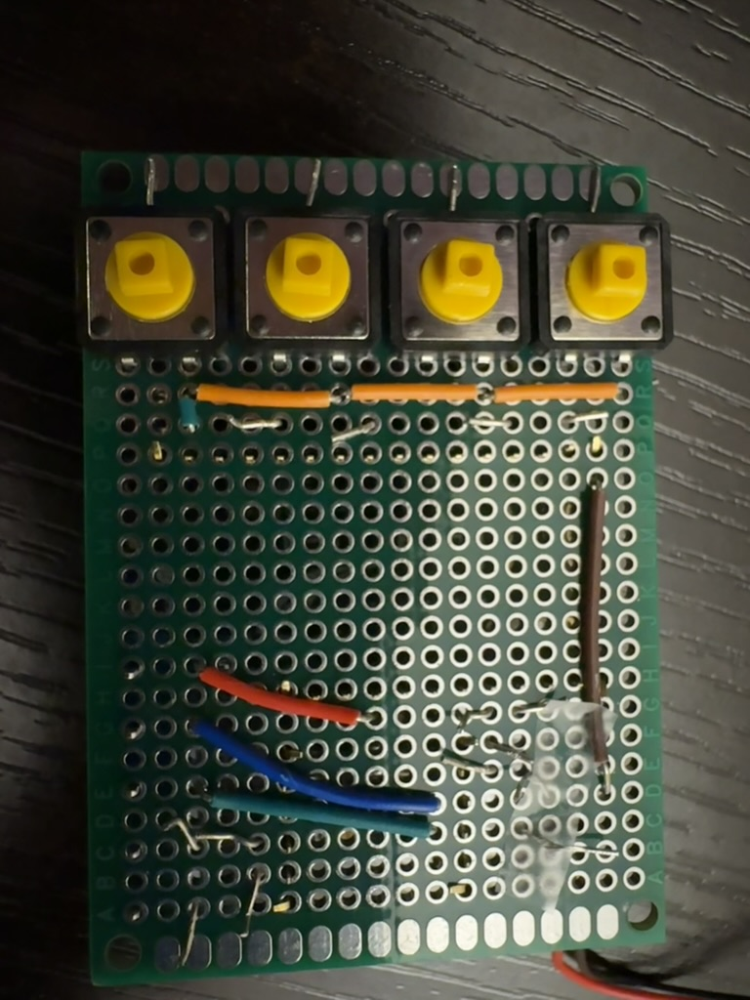

# Moto Scooper

A motorized pooper-scooper for our client Mark, who uses a wheelchair and has limited hand dexterity. Normal scoopers are awkward from a seated position or need a hard squeeze, so ours extends and grabs with motors, controlled by pushbuttons. McMaster 1P13 Project 3, winter 2026, team of four. I did the electronics and code and designed the telescoping arm.

## How it works

Everything is 3D printed PLA. An arm brace straps to the forearm, a two-section telescoping shaft extends with a 100 mm linear actuator, and a scoop head at the end closes two gear-driven shovels with an MG995 servo. A plastic bag wraps the scoop so the waste goes straight in. Buttons live in a separate controller box on a cord so the weight stays off the arm.

Weight 590 g, length 650–750 mm, runs on 4×AA.

## Electronics

Prototyped on a breadboard with an Arduino Uno to prove the code worked before the body was printed.

Final version is two perfboards: a button board, and a control board with an Adafruit Feather M0 Express and a DRV8833 motor driver. Everything is soldered or on screw terminals, which holds up a lot better than breadboard jumpers.

Code is in `firmware/`. `combined_code_v3.ino` is what runs on the final device: two buttons step the servo open/closed, two buttons drive the actuator out/in.

## What I learned

Powering it was the hard part. A 9 V battery stepped down to 5 V made the servo whine and overshoot with no holding torque. A 3.7 V cell stepped up to 6 V did the same thing. Four AAs straight to the motors (6 V, no converter) fixed it instantly. On paper both converter setups should have worked; in practice they couldn't supply the current the motors wanted. Test it before you trust it.

