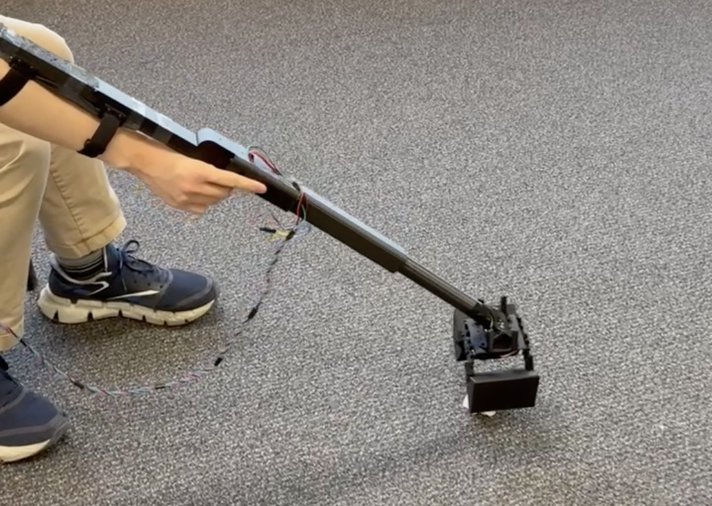
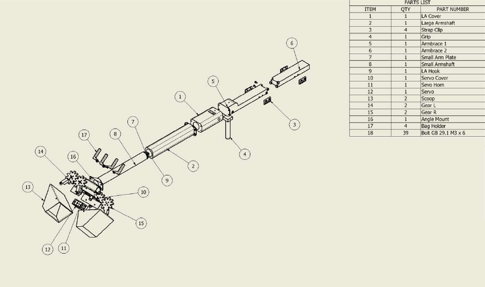
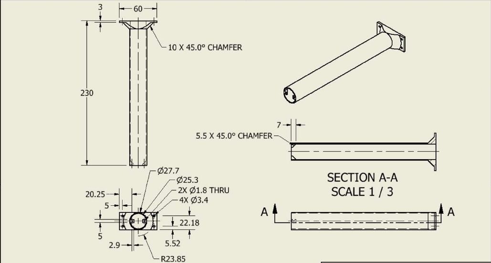
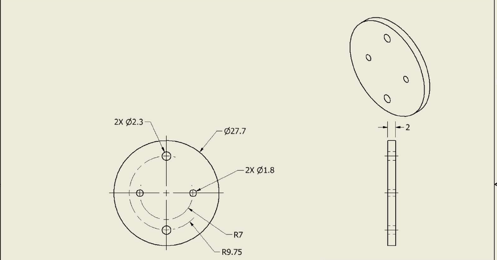
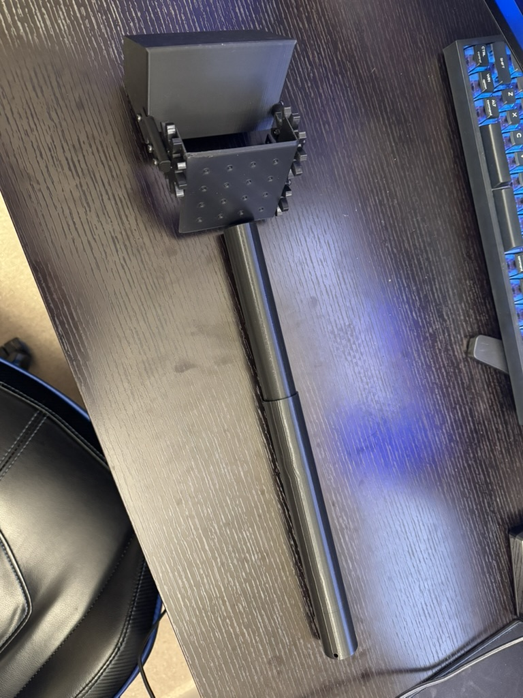
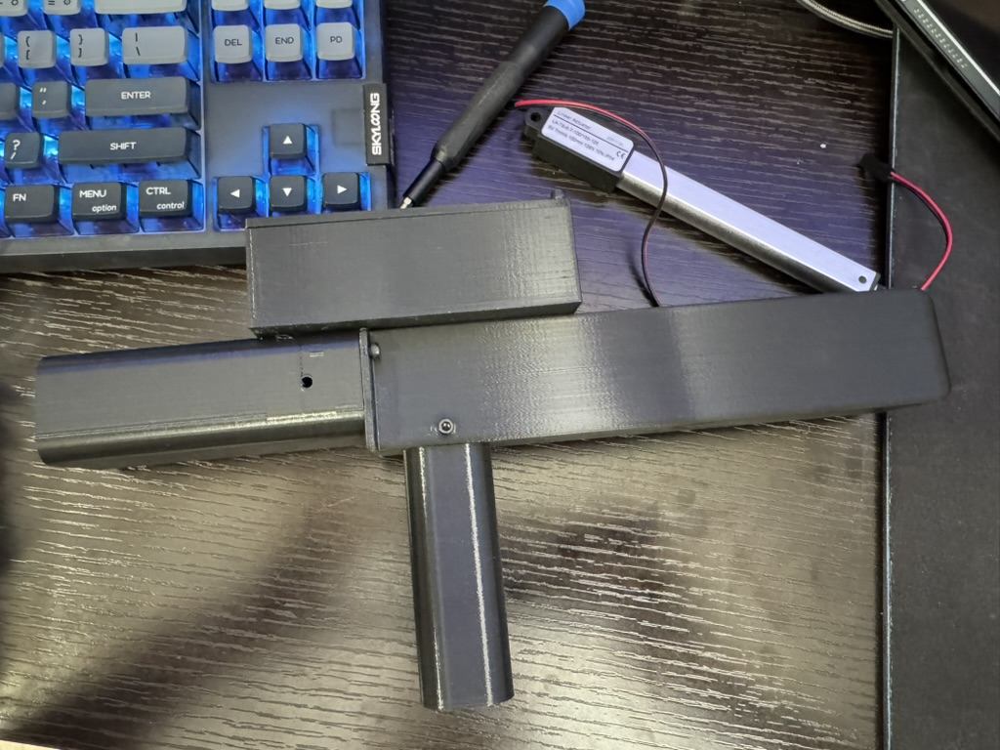
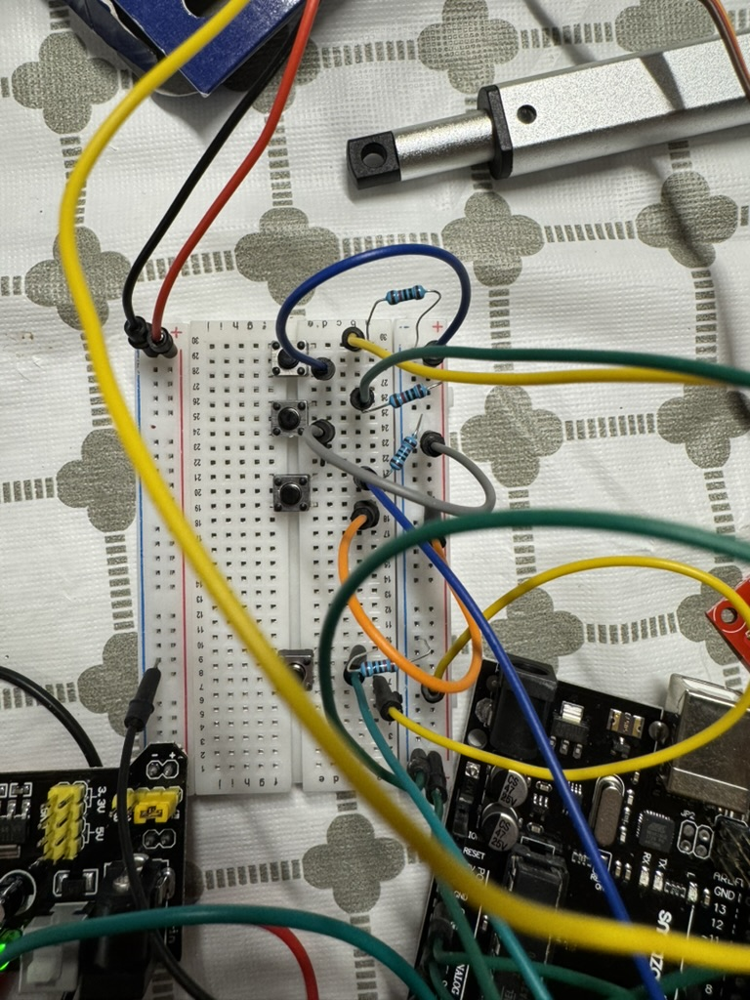
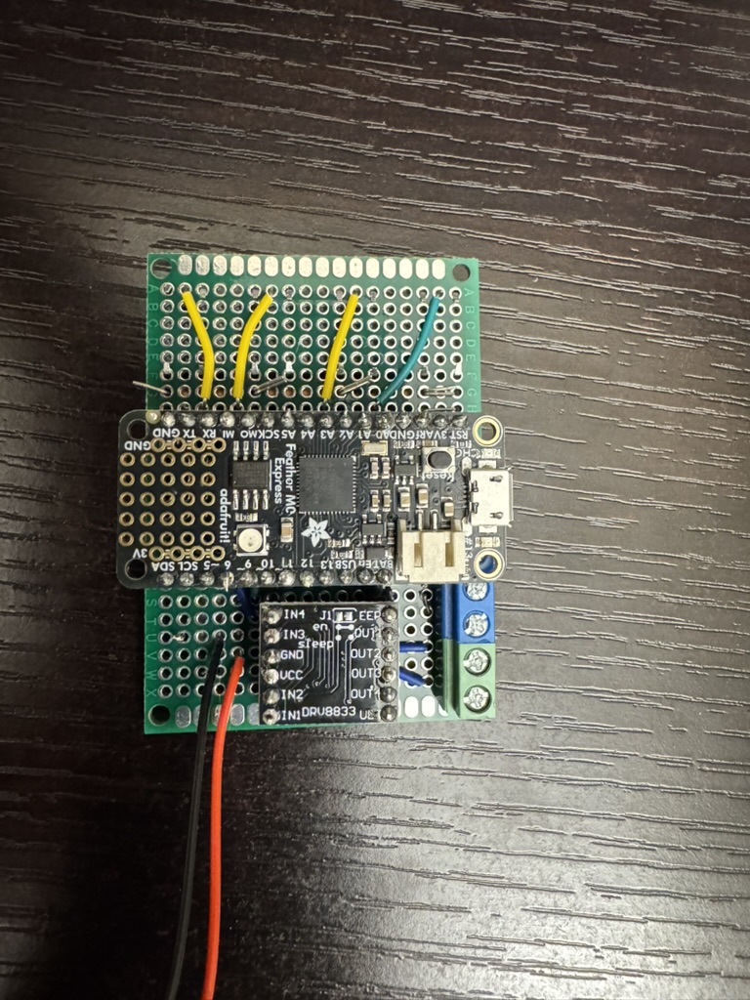
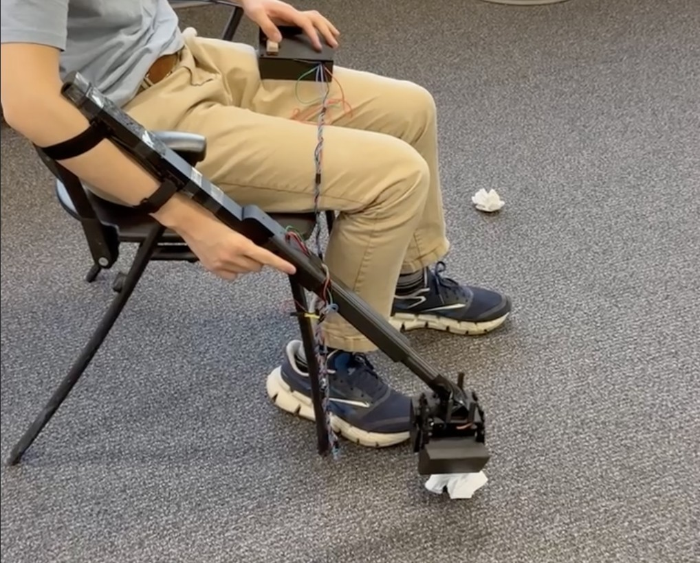
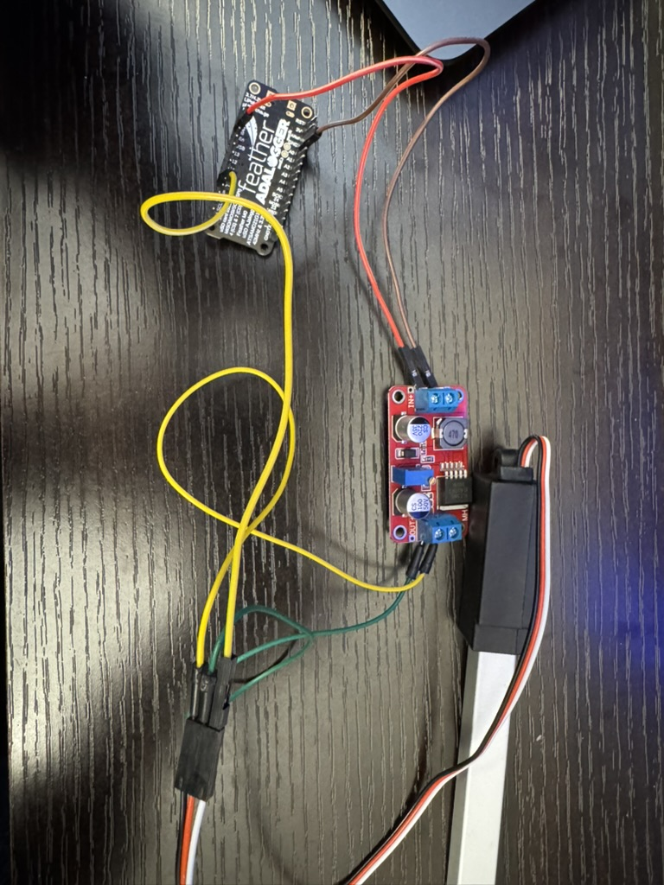

# Moto Scooper

A motorized pooper-scooper for our client, who uses a wheelchair and has limited hand dexterity. Normal scoopers are awkward from an elevated seated position or are operated mechanically requiring the users hands to squeeze. Our design extends and grabs with motors, controlled by pushbuttons. First year engineering design project, winter 2026, team of four. I did the electronics and code and designed the telescoping arm.





## Build

**Body.** 3D printed PLA in three sections: scoop head, telescoping shaft, and arm brace. Teammates did the head and arm brace, I designed the shaft. A 100 mm linear actuator extends the shaft, an MG995 servo closes the gear-driven shovels. Buttons sit in a separate controller box on a cord to keep weight off the arm.

590 g, 650–750 mm in length, runs on 4×AA.









**Electronics.** Started on a breadboard with an Arduino Uno, LA-T8 actuator, and MG995 servo; this served as a bench test to make sure my code worked before everything went into the printed body. The final design swaps the breadboard for a perfboard with a Feather microcontroller and DRV8833 driver. The DRV8833 and Feather are removable by headers soldered onto the perfboard, connections on the perfboard are made by soldered jumper wires acting as traces, and wires are secured and detachable via screw terminals, which is vastly superior to the friction fit of breadboard wires.





**Code.** `firmware/combined_code_v3.ino` runs on the final device. Two buttons step the servo open/closed, two drive the actuator out/in.

<details>
<summary><b>View <code>combined_code_v3.ino</code></b></summary>

```cpp
//servo
#include <Servo.h>
Servo myservo;
int pos = 50;
int but24 = A4;
int but28 = 30;
int s_control = 13;

//linear actuator
int in3 = 5;
int in4 = 6;
int but7 = A0;
int but19 = A2;

void setup() {
  //servo
  myservo.attach(s_control);  
  pinMode(but24, INPUT_PULLDOWN);
  pinMode(but28, INPUT_PULLDOWN);
  Serial.begin(9600);

  //lin act
  pinMode(in3, OUTPUT);
  pinMode(in4, OUTPUT);

  pinMode(but7, INPUT_PULLDOWN);
  pinMode(but19, INPUT_PULLDOWN);

}

void loop() {
  //servo
   if (digitalRead(but24) && pos > 15) {
      myservo.write(pos);
      pos -= 5;
      delay(25);
    }

   else if (digitalRead(but28) && pos < 80) {
      myservo.write(pos);
      pos += 5;
      delay(25);
    }
    Serial.println(pos);


  //lin act
  if (digitalRead(but7)) {
    digitalWrite(in3, LOW);
    digitalWrite(in4, HIGH);
  }

  else if (digitalRead(but19)) {
    digitalWrite(in3, HIGH);
    digitalWrite(in4, LOW);
  }

  else {
    digitalWrite(in3, LOW);
    digitalWrite(in4, LOW);
  }
}
```

</details>

## Result

Picked up multiple crumpled pieces of paper from a seated position and dropped them into a plastic bag. Grip strength was sufficient to hold two phones and the arm extension worked without difficulty.



## What I learned

Powering the motor and servo caused me the most problems. A 9 V battery stepped down to 5 V made the servo whine, overshoot, and lose torque. It didn't supply enough amperage. A 3.7 V cell stepped up to 6 V had the same amperage problem. Four AAs straight to the servo and linear actuator fixed it instantly. On paper both converters should have worked; real world testing showed converting voltages introduced instability. Next time I'll design for modularity so swapping a flawed part is painless.


